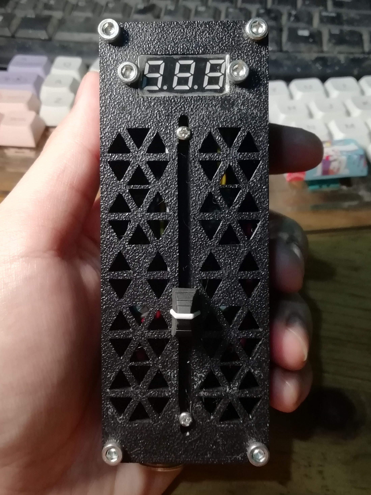
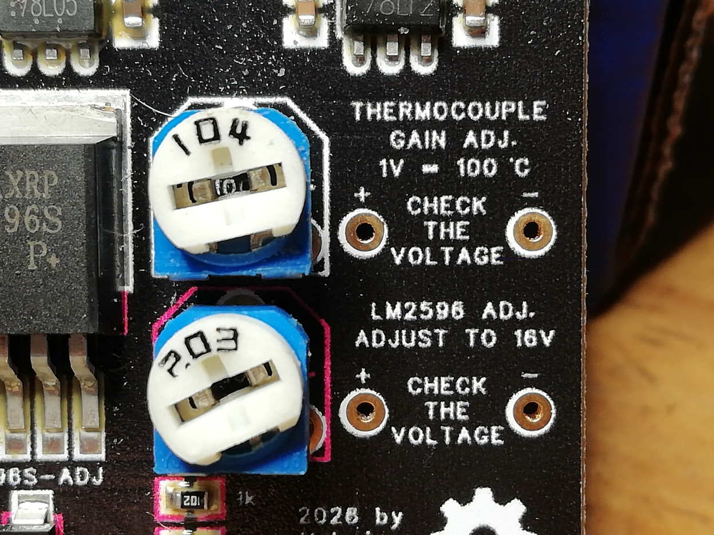
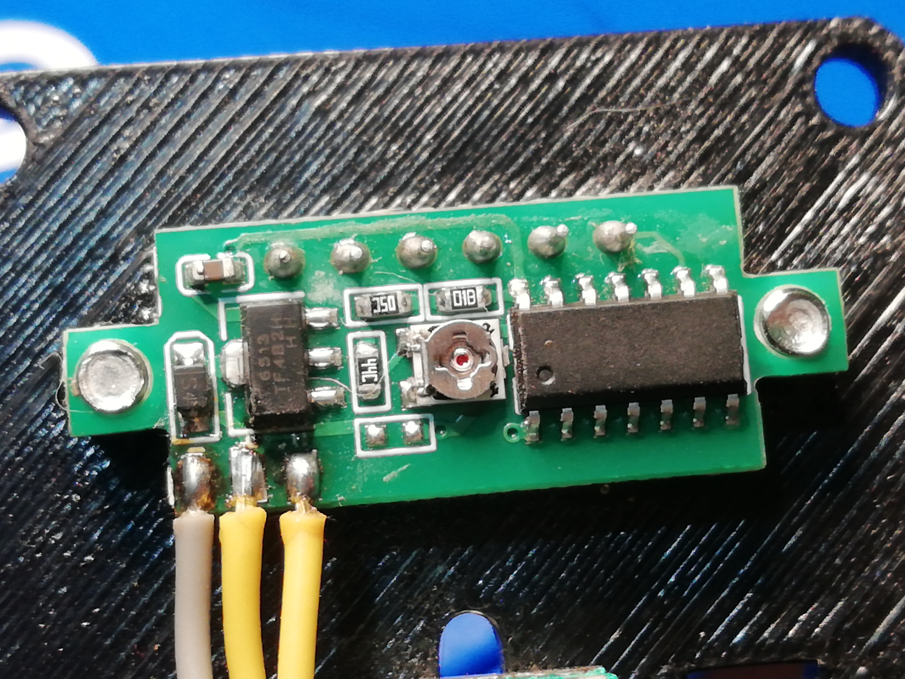
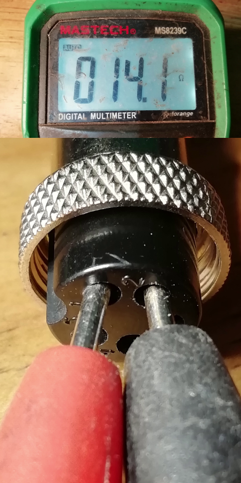
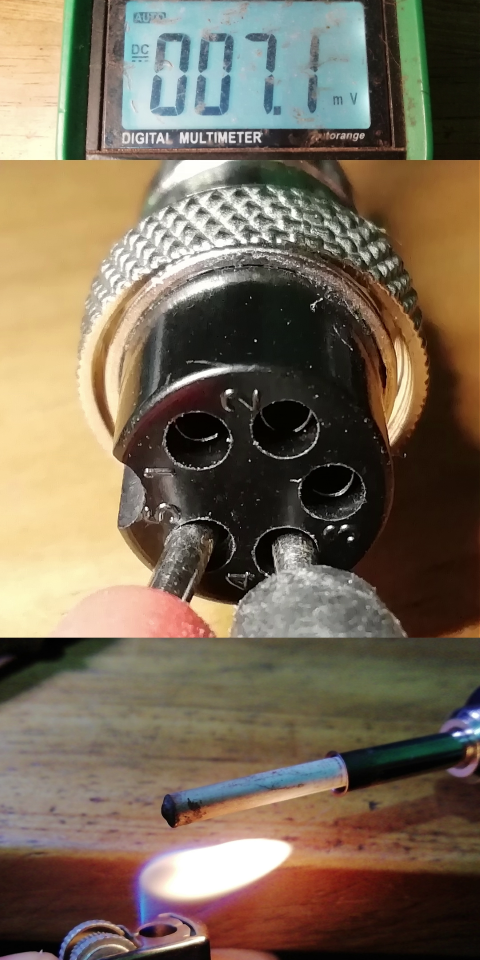

# 936-Soldering-Station

The **936 Soldering Station** is an open-source hardware module designed for DIY 936-style soldering station builds and controller replacements. It features a transient-protected, multi-stage power architecture and integrated precision calibration points for high thermal accuracy and hardware longevity.

## Key Features

* **Pure Analog Control:** Unlike many modern designs, this station uses no microcontrollers. By utilizing the widely available **LM358 op-amp**, the project remains easy to build, troubleshoot, and repair without the need for firmware flashing or specialized programming tools.
* **Schmitt Trigger Switching:** Utilizes a tuned positive feedback loop (hysteresis) to ensure the MOSFET operates strictly in a "snap-action" mode.
* **Multi-Stage Power Protection:** Implements an LM2596 buck converter to safely step down the main 24V input. This intermediate voltage then feeds the 7812 and 7805 linear regulators in parallel, preventing them from blowing out due to 24V hot-plug inductive spikes or thermal overload.
* **Temperature Monitoring:** Support for a 3-wire digital voltmeter to provide real-time temperature readout via calibrated analog scaling.
* **Dual Test-Point Calibration:** Equipped with dedicated onboard test points to safely measure and tune the intermediate buck regulation voltage and the amplified thermal feedback.
* **Linear Thermal Scaling:** Outbound thermocouple feedback is mapped linearly where 1V = 100°C, simplifying verification and calibration with any standard multimeter.

## Technical Specifications

| Parameter | Specification |
| :--- | :--- |
| **Main Input Voltage** | 24V DC |
| **Control Architecture** | Analog Schmitt Trigger (LM358 Based) |
| **Power Supply Topology** | LM2596 Buck -> (7812 & 7805 in parallel) |
| **Analog Regulation** | 7812 (LM358 power) & 7805 (Potentiometer reference) |
| **Thermal Scaling** | 1V = 100°C at Test Point 1 (TP1) |
| **Switching Element** | TO-252 MOSFET Footprint (AOD444, 50N06, or equivalent) |

## Hardware & Calibration Layout

### 1. Power Calibration (TP2)
To protect the linear regulation stages from excessive thermal dissipation or overvoltage damage, the LM2596 output must be set precisely before reaching the 7812 and 7805 ICs.
* **Test Point:** TP2 (located directly side-by-side with the voltage calibration trimpot).
* **Procedure:** Measure voltage at TP2 against ground and adjust the potentiometer until the target pre-regulation voltage is met.

### 2. Thermal Feedback Verification (TP1)
The controller uses the LM358 op-amp (powered by the clean 12V rail) to amplify the microvolt signal from the iron's internal K-type thermocouple into a linear voltage output.
* **Test Point:** TP1 (monitors the output of the thermocouple operational amplifier).
* **Scaling Ratio:** Optimized at a 1V = 100°C ratio. For example, a reading of 3.5V directly represents a tip temperature of 350°C.

## Digital Temperature Display (Voltmeter)

This board supports a real-time digital readout using a standard **3-wire DC Voltmeter**. Tuning the gain-setting potentiometer on the PCB allows the voltmeter to accurately display the temperature.

## Identifying & Testing Your Iron Handle

This board is designed strictly for **K-Type Thermocouple** 936 handles, not the thermistor/A1321 variants. Because cheap clone handles rarely come with documentation, you can verify your handle using a multimeter and a lighter before plugging it in.

**The 5-Pin Layout Logic:**
On a standard 5-pin aviation plug, **Pin 3 (the center pin)** is always designated for Earth/Ground (ESD safe). This leaves you with two distinct pairs of pins: **Pins 1 & 2** and **Pins 4 & 5**. One pair is the 24V Heater, and the other is the Thermocouple.

**Step 1: Find the Heater Element**
1. Set your multimeter to measure Resistance (Ohms).
2. Probe the pairs. The pair that reads approximately **12Ω to 16Ω** (often around 14Ω) is your 24V heater element. 

**Step 2: The "Lighter Test" (Verify the Thermocouple)**
1. Connect your multimeter probes to the remaining pair of pins.
2. Set your multimeter to read DC millivolts (mV).
3. Take a lighter and gently apply heat to the tip of the soldering iron.
4. **The Result:** If you see the voltage slowly increase on the multimeter (even just by a few mV), you have successfully identified the K-Type thermocouple pins!

| Ohm                                     | Thermocouple                                              |
| -----------------------------------     | -----------------------------------                       |
|  |  |

## Reference
- [LM358 Datasheet](https://www.lcsc.com/datasheet/C5423.pdf?spm=wm.sxq.inf.ggs___wm.fly.bg.3.xh&lcsc_vid=RFNfUAVSFAAMUgJXRlgPBV0AFVNaAVRXFlcNVgIEE1YxVlNRTlBWVVVTT1lbXjsOAxUeFF5JWBYZEEoKFBINSQcJGk4%3D)
- [LM2596S Datasheet](https://www.lcsc.com/datasheet/C347423.pdf?spm=wm.sxq.inf.ggs___wm.fly.bg.1.xh&lcsc_vid=RFNfUAVSFAAMUgJXRlgPBV0AFVNaAVRXFlcNVgIEE1YxVlNRTlBWVVdUQFZdVDsOAxUeFF5JWBYZEEoKFBINSQcJGk4dAgUUFAk%3D)
- [78L12 Datasheet](https://www.lcsc.com/datasheet/C5337208.pdf)
- [78L05 Datasheet](https://www.lcsc.com/datasheet/C347258.pdf?spm=wm.sxq.inf.ggs___wm.ssy.em.2.tz&lcsc_vid=RFNfUAVSFAAMUgJXRlgPBV0AFVNaAVRXFlcNVgIEE1YxVlNRTlBWVVFXQ1JeXzsOAxUeFF5JWBYZEEoKFBINSQcJGk4dAgUUFAk%3D)
